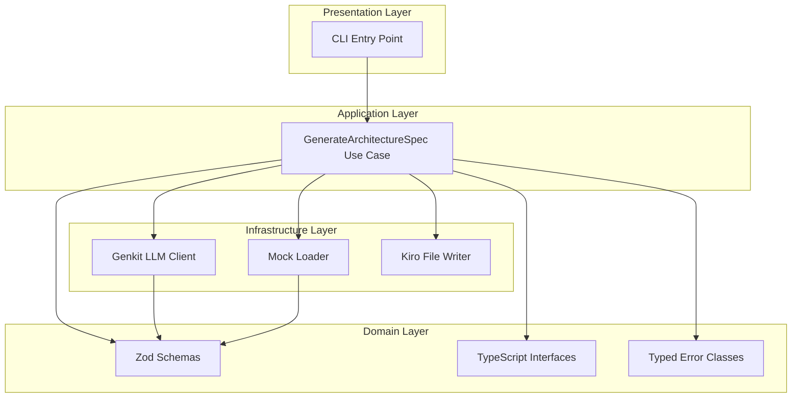
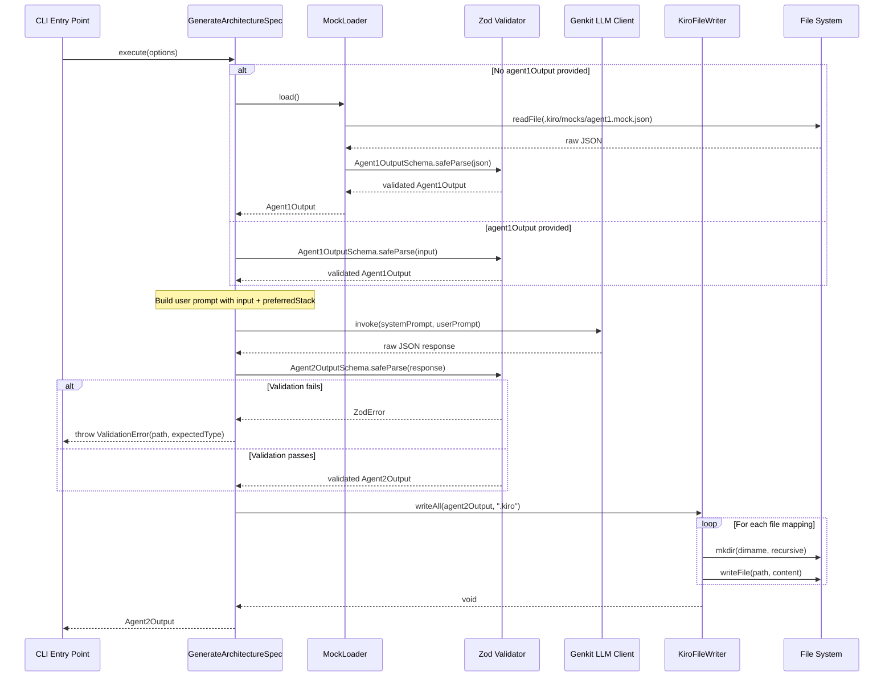

# Design Document: Agent 2 — Architect Agent

## Overview

Agent 2 (Architect Agent) is a Next.js (App Router) + TypeScript service that receives structured input from Agent 1 (or a development mock), invokes an LLM with a Principal Architect system prompt, validates the structured output against Zod schemas, and persists the results as specification files in the `.kiro/` workspace.

**Core Stack**: Next.js (App Router), TypeScript, Node.js Runtime, Genkit / LangChain / Vercel AI SDK, Zod Schema Validation, Docker.

The system follows **Clean Architecture** with strict layer boundaries:

- **Domain Layer**: Pure TypeScript types, Zod schemas, and business rules (no I/O)
- **Application Layer**: Use cases orchestrating validation → LLM invocation → output validation
- **Infrastructure Layer**: LLM client (Genkit / Vercel AI SDK), filesystem writer, mock loader
- **Presentation Layer**: Next.js App Router API routes and React UI components

Design decisions:

- **Zod over manual validation**: Compile-time type inference + runtime validation in one declaration
- **Genkit / Vercel AI SDK**: Structured output support, streaming, and tool integration out-of-box. Vercel AI SDK for Next.js-native streaming; Genkit for advanced orchestration pipelines.
- **Typed errors over generic throws**: Enables callers to handle transient vs permanent failures differently
- **Mock-first development**: Agent 2 is fully testable without Agent 1 running

## Architecture



### Layer Boundaries

| Layer          | Allowed Dependencies           | Forbidden                        |
| -------------- | ------------------------------ | -------------------------------- |
| Domain         | None (pure)                    | I/O, external libs (except Zod)  |
| Application    | Domain                         | Infrastructure directly          |
| Infrastructure | Domain, Application interfaces | Cross-infrastructure coupling    |
| Presentation   | Application                    | Domain internals, Infrastructure |

**Dependency Rule**: Dependencies point inward only. Infrastructure implements interfaces defined in Application.

## Components and Interfaces

### Domain Layer — TypeScript Interfaces

```typescript
// src/domain/types.ts

export interface Agent1Output {
  projectName: string;
  productVision: string;
  targetAudience: string;
  valueProposition: string;
  mvpFeatures: string[];
  expectedMetrics: ExpectedMetrics;
}

export interface ExpectedMetrics {
  mvpMonthlyUsers: number;
  scaleMonthlyUsers: number;
  peakConcurrentConnections: number;
}

export interface TechSteering {
  stack: string[];
  architecturePattern: "Clean" | "Hexagonal";
  solidBoundaries: SolidBoundary[];
  securityGuards: SecurityGuard[];
}

export interface SolidBoundary {
  principle: string;
  rule: string;
  layer: string;
}

export interface SecurityGuard {
  name: string;
  description: string;
  enforcement: string;
}

export interface DesignOutput {
  domainEntities: DomainEntity[];
  mermaidDiagram: string;
  iamPolicySummary: IamPolicy[];
  awsCostProjection: CostProjection;
}
```

export interface DomainEntity {
name: string;
properties: EntityProperty[];
relationships: string[];
}

export interface EntityProperty {
name: string;
type: string;
required: boolean;
}

export interface IamPolicy {
service: string;
actions: string[];
resource: string;
effect: 'Allow' | 'Deny';
}

export interface CostProjection {
mvpMonthlyCostUsd: ServiceCost[];
scaleMonthlyCostUsd: ServiceCost[];
}

export interface ServiceCost {
service: string;
monthlyCostUsd: number;
}

export interface TaskItem {
id: string;
title: string;
description: string;
dependencies: string[];
}

export interface Agent2Output {
techSteering: TechSteering;
requirements: string; // EARS-formatted markdown
design: DesignOutput;
tasks: TaskItem[];
}

export interface GenerateSpecOptions {
agent1Output?: Agent1Output;
preferredStack?: string[];
}

```

```

### Domain Layer — Zod Schemas

```typescript
// src/domain/schemas.ts
import { z } from "zod";

export const ExpectedMetricsSchema = z.object({
  mvpMonthlyUsers: z.number().positive(),
  scaleMonthlyUsers: z.number().positive(),
  peakConcurrentConnections: z.number().positive(),
});

export const Agent1OutputSchema = z.object({
  projectName: z.string().min(1),
  productVision: z.string().min(1),
  targetAudience: z.string().min(1),
  valueProposition: z.string().min(1),
  mvpFeatures: z.array(z.string().min(1)).min(1),
  expectedMetrics: ExpectedMetricsSchema,
});

export const SolidBoundarySchema = z.object({
  principle: z.string().min(1),
  rule: z.string().min(1),
  layer: z.string().min(1),
});

export const SecurityGuardSchema = z.object({
  name: z.string().min(1),
  description: z.string().min(1),
  enforcement: z.string().min(1),
});

export const TechSteeringSchema = z.object({
  stack: z.array(z.string().min(1)).min(1),
  architecturePattern: z.enum(["Clean", "Hexagonal"]),
  solidBoundaries: z.array(SolidBoundarySchema).min(1),
  securityGuards: z.array(SecurityGuardSchema).min(1),
});
```

export const RequirementsSchema = z.object({
content: z.string().min(1),
});

export const DomainEntitySchema = z.object({
name: z.string().min(1),
properties: z.array(z.object({
name: z.string().min(1),
type: z.string().min(1),
required: z.boolean(),
})).min(1),
relationships: z.array(z.string()),
});

export const IamPolicySchema = z.object({
service: z.string().min(1),
actions: z.array(z.string().min(1)).min(1),
resource: z.string().min(1),
effect: z.enum(['Allow', 'Deny']),
});

export const ServiceCostSchema = z.object({
service: z.string().min(1),
monthlyCostUsd: z.number().nonnegative(),
});

export const CostProjectionSchema = z.object({
mvpMonthlyCostUsd: z.array(ServiceCostSchema).min(1),
scaleMonthlyCostUsd: z.array(ServiceCostSchema).min(1),
});

export const DesignSchema = z.object({
domainEntities: z.array(DomainEntitySchema).min(1),
mermaidDiagram: z.string().min(1),
iamPolicySummary: z.array(IamPolicySchema).min(1),
awsCostProjection: CostProjectionSchema,
});

export const TaskItemSchema = z.object({
id: z.string().min(1),
title: z.string().min(1),
description: z.string().min(1),
dependencies: z.array(z.string()),
});

export const TasksSchema = z.object({
items: z.array(TaskItemSchema).min(1),
});

export const Agent2OutputSchema = z.object({
techSteering: TechSteeringSchema,
requirements: RequirementsSchema,
design: DesignSchema,
tasks: TasksSchema,
});

```

```

### Domain Layer — Typed Errors

```typescript
// src/domain/errors.ts

export type ErrorCategory =
  | "VALIDATION"
  | "LLM_TRANSIENT"
  | "LLM_PERMANENT"
  | "FILESYSTEM";

export class Agent2Error extends Error {
  constructor(
    message: string,
    public readonly category: ErrorCategory,
    public readonly operation: string,
    public readonly context: Record<string, unknown>,
    public readonly cause?: Error,
  ) {
    super(message);
    this.name = "Agent2Error";
  }
}

export class ValidationError extends Agent2Error {
  constructor(
    public readonly fieldPath: string,
    public readonly expectedType: string,
    public readonly receivedValue: unknown,
    operation: string,
  ) {
    super(
      `Validation failed at "${fieldPath}": expected ${expectedType}`,
      "VALIDATION",
      operation,
      { fieldPath, expectedType, receivedValue },
    );
    this.name = "ValidationError";
  }
}

export class LlmError extends Agent2Error {
  constructor(
    message: string,
    public readonly isTransient: boolean,
    operation: string,
    context: Record<string, unknown>,
    cause?: Error,
  ) {
    super(
      message,
      isTransient ? "LLM_TRANSIENT" : "LLM_PERMANENT",
      operation,
      context,
      cause,
    );
    this.name = "LlmError";
  }
}
```

export class FilesystemError extends Agent2Error {
constructor(
public readonly targetPath: string,
operation: string,
cause: Error,
) {
super(
`Filesystem error at "${targetPath}": ${cause.message}`,
'FILESYSTEM',
operation,
{ targetPath },
cause,
);
this.name = 'FilesystemError';
}
}

````

### Application Layer — Use Case

```typescript
// src/application/generate-architecture-spec.ts

import { Agent1Output, Agent2Output, GenerateSpecOptions } from '../domain/types';
import { Agent1OutputSchema, Agent2OutputSchema } from '../domain/schemas';
import { ValidationError, LlmError } from '../domain/errors';

export interface LlmPort {
  invoke(systemPrompt: string, userPrompt: string): Promise<unknown>;
}

export interface MockLoaderPort {
  load(): Promise<Agent1Output>;
}

export interface FileWriterPort {
  writeAll(output: Agent2Output, basePath: string): Promise<void>;
}

````

export class GenerateArchitectureSpecUseCase {
constructor(
private readonly llm: LlmPort,
private readonly mockLoader: MockLoaderPort,
private readonly fileWriter: FileWriterPort,
private readonly systemPrompt: string,
) {}

async execute(options: GenerateSpecOptions = {}): Promise<Agent2Output> {
// 1. Resolve input (Agent1 output or mock fallback)
const rawInput = options.agent1Output ?? await this.mockLoader.load();

    // 2. Validate input
    const inputResult = Agent1OutputSchema.safeParse(rawInput);
    if (!inputResult.success) {
      throw this.mapZodError(inputResult.error, 'input-validation');
    }

    // 3. Build user prompt with input context
    const userPrompt = this.buildUserPrompt(inputResult.data, options.preferredStack);

    // 4. Invoke LLM
    let rawOutput: unknown;
    try {
      rawOutput = await this.llm.invoke(this.systemPrompt, userPrompt);
    } catch (error) {
      throw this.classifyLlmError(error, inputResult.data);
    }

    // 5. Validate output
    const outputResult = Agent2OutputSchema.safeParse(rawOutput);
    if (!outputResult.success) {
      throw this.mapZodError(outputResult.error, 'output-validation');
    }

    // 6. Write to disk
    await this.fileWriter.writeAll(outputResult.data, '.kiro');

    return outputResult.data;

}
private buildUserPrompt(input: Agent1Output, preferredStack?: string[]): string {
const stackNote = preferredStack
? `\nPreferred stack: ${preferredStack.join(', ')}`
: '';
return JSON.stringify(input) + stackNote;
}

private mapZodError(zodError: z.ZodError, operation: string): ValidationError {
const firstIssue = zodError.issues[0];
return new ValidationError(
firstIssue.path.join('.'),
firstIssue.message,
undefined,
operation,
);
}

private classifyLlmError(error: unknown, input: Agent1Output): LlmError {
const isTransient = error instanceof Error &&
(error.message.includes('timeout') ||
error.message.includes('ECONNRESET') ||
error.message.includes('503'));

    return new LlmError(
      error instanceof Error ? error.message : 'Unknown LLM error',
      isTransient,
      'llm-invocation',
      { projectName: input.projectName },
      error instanceof Error ? error : undefined,
    );

}
}

```

```

### Infrastructure Layer — Mock Loader

```typescript
// src/infrastructure/mock-loader.ts
import { readFile } from "node:fs/promises";
import { Agent1Output } from "../domain/types";
import { Agent1OutputSchema } from "../domain/schemas";
import { MockLoaderPort } from "../application/generate-architecture-spec";
import { ValidationError } from "../domain/errors";

const MOCK_PATH = ".kiro/mocks/agent1.mock.json";

export class JsonMockLoader implements MockLoaderPort {
  constructor(private readonly mockPath: string = MOCK_PATH) {}

  async load(): Promise<Agent1Output> {
    const raw = await readFile(this.mockPath, "utf-8");
    const parsed = JSON.parse(raw);

    const result = Agent1OutputSchema.safeParse(parsed);
    if (!result.success) {
      const issue = result.error.issues[0];
      throw new ValidationError(
        issue.path.join("."),
        issue.message,
        undefined,
        "mock-loading",
      );
    }
    return result.data;
  }
}
```

### Infrastructure Layer — LLM Client (Genkit)

```typescript
// src/infrastructure/llm-client.ts
import { generateObject } from "ai";
import { openai } from "@ai-sdk/openai";
import { Agent2OutputSchema } from "../domain/schemas";
import { LlmPort } from "../application/generate-architecture-spec";

export class VercelAiLlmClient implements LlmPort {
  constructor(private readonly model: string = "gpt-4o") {}

  async invoke(systemPrompt: string, userPrompt: string): Promise<unknown> {
    const { object } = await generateObject({
      model: openai(this.model),
      schema: Agent2OutputSchema,
      system: systemPrompt,
      prompt: userPrompt,
    });

    return object;
  }
}
```

> **Note**: The project supports both Vercel AI SDK (`ai` package with `generateObject`) for Next.js-native structured output, and Genkit (`@genkit-ai/ai`) for advanced orchestration pipelines. The LlmPort abstraction allows swapping adapters without touching the application layer.

### Infrastructure Layer — Kiro File Writer

```typescript
// src/infrastructure/kiro-file-writer.ts
import { mkdir, writeFile } from "node:fs/promises";
import { dirname, join } from "node:path";
import {
  Agent2Output,
  TechSteering,
  DesignOutput,
  TaskItem,
} from "../domain/types";
import { FileWriterPort } from "../application/generate-architecture-spec";
import { FilesystemError } from "../domain/errors";

interface FileMapping {
  relativePath: string;
  content: string;
}

export class KiroFileWriter implements FileWriterPort {
  async writeAll(output: Agent2Output, basePath: string): Promise<void> {
    const mappings = this.buildFileMappings(output);

    for (const mapping of mappings) {
      const fullPath = join(basePath, mapping.relativePath);
      try {
        await mkdir(dirname(fullPath), { recursive: true });
        await writeFile(fullPath, mapping.content, "utf-8");
      } catch (error) {
        throw new FilesystemError(
          fullPath,
          "file-write",
          error instanceof Error ? error : new Error(String(error)),
        );
      }
    }
  }

  private buildFileMappings(output: Agent2Output): FileMapping[] {
    return [
      {
        relativePath: "steering/tech.md",
        content: this.formatTechSteering(output.techSteering),
      },
      { relativePath: "specs/requirements.md", content: output.requirements },
      {
        relativePath: "specs/design.md",
        content: this.formatDesign(output.design),
      },
      {
        relativePath: "specs/tasks.md",
        content: this.formatTasks(output.tasks),
      },
    ];
  }

  private formatTechSteering(steering: TechSteering): string {
    /* markdown formatting */
  }
  private formatDesign(design: DesignOutput): string {
    /* markdown formatting */
  }
  private formatTasks(tasks: TaskItem[]): string {
    /* markdown formatting */
  }
}
```

### System Prompt

The system prompt instructs the LLM to operate as a **Principal Architect and Financial Officer**:

```text
You are a Principal Software Architect and Financial Officer. Generate architecture
specifications following these rules:

1. ARCHITECTURE: Use Clean Architecture with strict layer boundaries
   (Domain → Application → Infrastructure → Presentation). All dependencies point inward.

2. VALIDATION: All output fields must conform to the provided JSON schema.
   Use Zod-style validation rules.

3. REQUIREMENTS: Write functional requirements in EARS syntax:
   - WHEN <trigger>, THE <system> SHALL <response>
   - WHILE <state>, THE <system> SHALL <response>
   - IF <condition>, THEN THE <system> SHALL <response>
   - WHERE <option>, THE <system> SHALL <response>
   - THE <system> SHALL <response>

4. SECURITY: Apply least-privilege IAM policies. Include Zod input validation,
   JWT auth, CORS, and HTTPS enforcement as security guards.

5. COSTS: Provide AWS cost projections itemized by service for MVP tier and Scale
   tier in USD/month.

6. TASKS: Order tasks sequentially. Each task's dependencies array must only
   reference IDs of previously listed tasks.

Respond ONLY with valid JSON matching the output schema.
```

## Data Models

### Agent 1 Output (Input to Agent 2)

| Field                                     | Type     | Required | Description                         |
| ----------------------------------------- | -------- | -------- | ----------------------------------- |
| projectName                               | string   | Yes      | Name of the project                 |
| productVision                             | string   | Yes      | High-level product vision statement |
| targetAudience                            | string   | Yes      | Who the product is for              |
| valueProposition                          | string   | Yes      | Core value delivered to users       |
| mvpFeatures                               | string[] | Yes      | List of MVP feature descriptions    |
| expectedMetrics.mvpMonthlyUsers           | number   | Yes      | Expected MVP monthly active users   |
| expectedMetrics.scaleMonthlyUsers         | number   | Yes      | Expected scale monthly active users |
| expectedMetrics.peakConcurrentConnections | number   | Yes      | Peak concurrent connections         |

### Agent 2 Output (Unified)

| Section      | Schema             | Target File                   |
| ------------ | ------------------ | ----------------------------- |
| techSteering | TechSteeringSchema | `.kiro/steering/tech.md`      |
| requirements | RequirementsSchema | `.kiro/specs/requirements.md` |
| design       | DesignSchema       | `.kiro/specs/design.md`       |
| tasks        | TasksSchema        | `.kiro/specs/tasks.md`        |

### Task Dependency Constraint

Tasks follow a topological ordering: for any task `T[i]`, all IDs in `T[i].dependencies` must reference tasks `T[j]` where `j < i`. This ensures the task list can be executed sequentially.

## Sequence Diagram



## Correctness Properties

_A property is a characteristic or behavior that should hold true across all valid executions of a system — essentially, a formal statement about what the system should do. Properties serve as the bridge between human-readable specifications and machine-verifiable correctness guarantees._

### Property 1: Schema validation rejects invalid objects with correct error paths

_For any_ object that violates the Agent2OutputSchema (missing fields, wrong types, invalid nesting), the Zod validator SHALL return an error that identifies the exact field path where validation failed and the expected type at that path.

**Validates: Requirements 1.4, 2.5, 3.5, 5.2**

### Property 2: Valid Agent2Output round-trip through schema

_For any_ valid Agent2Output object (conforming to all schema constraints), parsing it through Agent2OutputSchema SHALL succeed and produce an object deeply equal to the original input.

**Validates: Requirements 2.1, 2.3, 2.4, 2.6**

### Property 3: File writer preserves all output content

_For any_ valid Agent2Output object, after the KiroFileWriter writes all files, reading each file back SHALL yield content that contains the corresponding section's data without loss or corruption.

**Validates: Requirements 4.1, 4.2, 4.3, 4.4**

### Property 4: Input validation precedes LLM invocation

_For any_ invalid Agent1Output provided to generateArchitectureSpec, the system SHALL throw a ValidationError BEFORE any LLM invocation occurs (the LLM port is never called).

**Validates: Requirements 5.1, 5.2**

### Property 5: All errors carry contextual information

_For any_ error thrown by Agent2 (validation, LLM, or filesystem), the error object SHALL include the operation name that failed and relevant context about the triggering input.

**Validates: Requirements 5.4**

### Property 6: Task dependencies form a valid topological order

_For any_ valid task list produced by Agent2, every task's dependencies array SHALL contain only IDs of tasks that appear earlier in the list (i.e., for task at index `i`, all dependency IDs reference tasks at index `j < i`).

**Validates: Requirements 6.5**

## Error Handling

### Error Classification

| Error Type           | Category      | Retryable | Contains                                          |
| -------------------- | ------------- | --------- | ------------------------------------------------- |
| ValidationError      | VALIDATION    | No        | fieldPath, expectedType, receivedValue, operation |
| LlmError (transient) | LLM_TRANSIENT | Yes       | message, operation, context, isTransient=true     |
| LlmError (permanent) | LLM_PERMANENT | No        | message, operation, context, isTransient=false    |
| FilesystemError      | FILESYSTEM    | Maybe     | targetPath, operation, cause                      |

### Transient vs Permanent LLM Errors

- **Transient** (retryable): timeouts, connection resets, 503 Service Unavailable
- **Permanent** (not retryable): 401 Unauthorized, 400 Bad Request, model not found, quota exceeded

### Error Propagation Strategy

1. All errors extend `Agent2Error` base class with `category`, `operation`, and `context`
2. Zod validation errors are mapped to `ValidationError` with the first issue's path and message
3. LLM errors are classified by inspecting the error message for known transient patterns
4. Filesystem errors wrap the original error and include the target path
5. Callers can switch on `error.category` for handling strategy

### Fallback Paths

| Scenario                  | Behavior                                                                |
| ------------------------- | ----------------------------------------------------------------------- |
| No Agent1 output provided | Load mock from `.kiro/mocks/agent1.mock.json`                           |
| Mock file missing         | Throw FilesystemError (no silent fallback)                              |
| LLM transient failure     | Throw LlmError with `isTransient=true` (caller decides retry)           |
| Output validation failure | Throw ValidationError (no auto-retry — LLM output is non-deterministic) |
| Directory doesn't exist   | Create with `mkdir -p` semantics before write                           |

## Testing Strategy

### Dual Testing Approach

**Property-Based Tests (fast-check)**:

- Library: [fast-check](https://github.com/dubzzz/fast-check) for TypeScript
- Minimum 100 iterations per property
- Each test tagged with property reference: `Feature: agent2-architect, Property N: <title>`
- Focus: Schema validation correctness, file writer preservation, error context, topological ordering

**Unit Tests (Vitest)**:

- Framework: Vitest
- Focus: Specific examples, edge cases, integration points
- Mock LLM responses for deterministic testing
- Mock filesystem for write verification

**Integration Tests**:

- Full pipeline with mocked LLM (deterministic JSON responses)
- Verify end-to-end: input → validation → prompt building → output validation → file writes
- 2-3 representative scenarios (happy path, mock fallback, validation failure)

### Test Configuration

```typescript
// vitest.config.ts
import { defineConfig } from "vitest/config";

export default defineConfig({
  test: {
    include: ["src/**/*.test.ts", "src/**/*.property.ts"],
    coverage: {
      provider: "v8",
      include: ["src/domain/**", "src/application/**", "src/infrastructure/**"],
    },
  },
});
```

### Property Test Mapping

| Property                                      | Test File                                | What It Validates                           |
| --------------------------------------------- | ---------------------------------------- | ------------------------------------------- |
| Property 1: Schema rejects invalid with paths | `schemas.property.ts`                    | Invalid objects produce correct error paths |
| Property 2: Valid output round-trip           | `schemas.property.ts`                    | Valid objects pass and remain equal         |
| Property 3: File writer preserves content     | `kiro-file-writer.property.ts`           | Written files contain original data         |
| Property 4: Input validation precedes LLM     | `generate-architecture-spec.property.ts` | LLM never called for invalid input          |
| Property 5: Error context propagation         | `errors.property.ts`                     | All errors carry operation + context        |
| Property 6: Task topological ordering         | `schemas.property.ts`                    | Dependencies only reference earlier tasks   |

## File Structure

```
src/
├── domain/
│   ├── types.ts              # Pure TypeScript interfaces
│   ├── schemas.ts            # Zod schema definitions
│   └── errors.ts             # Typed error classes
├── application/
│   └── generate-architecture-spec.ts  # Use case with port interfaces
├── infrastructure/
│   ├── mock-loader.ts        # JSON mock file loader
│   ├── llm-client.ts         # Vercel AI SDK / Genkit LLM adapter
│   └── kiro-file-writer.ts   # Filesystem writer
├── presentation/
│   ├── api/
│   │   └── generate-spec/
│   │       └── route.ts      # Next.js App Router API route
│   └── components/           # React UI components (if applicable)
├── config/
│   └── system-prompt.ts      # System prompt constant
└── __tests__/
    ├── domain/
    │   ├── schemas.test.ts          # Unit tests for schemas
    │   └── schemas.property.ts      # Property tests (P1, P2, P6)
    ├── application/
    │   ├── generate-architecture-spec.test.ts      # Unit tests
    │   └── generate-architecture-spec.property.ts  # Property tests (P4)
    ├── infrastructure/
    │   ├── kiro-file-writer.test.ts       # Unit tests
    │   ├── kiro-file-writer.property.ts   # Property tests (P3)
    │   └── mock-loader.test.ts            # Unit tests
    └── errors.property.ts                 # Property tests (P5)
```
