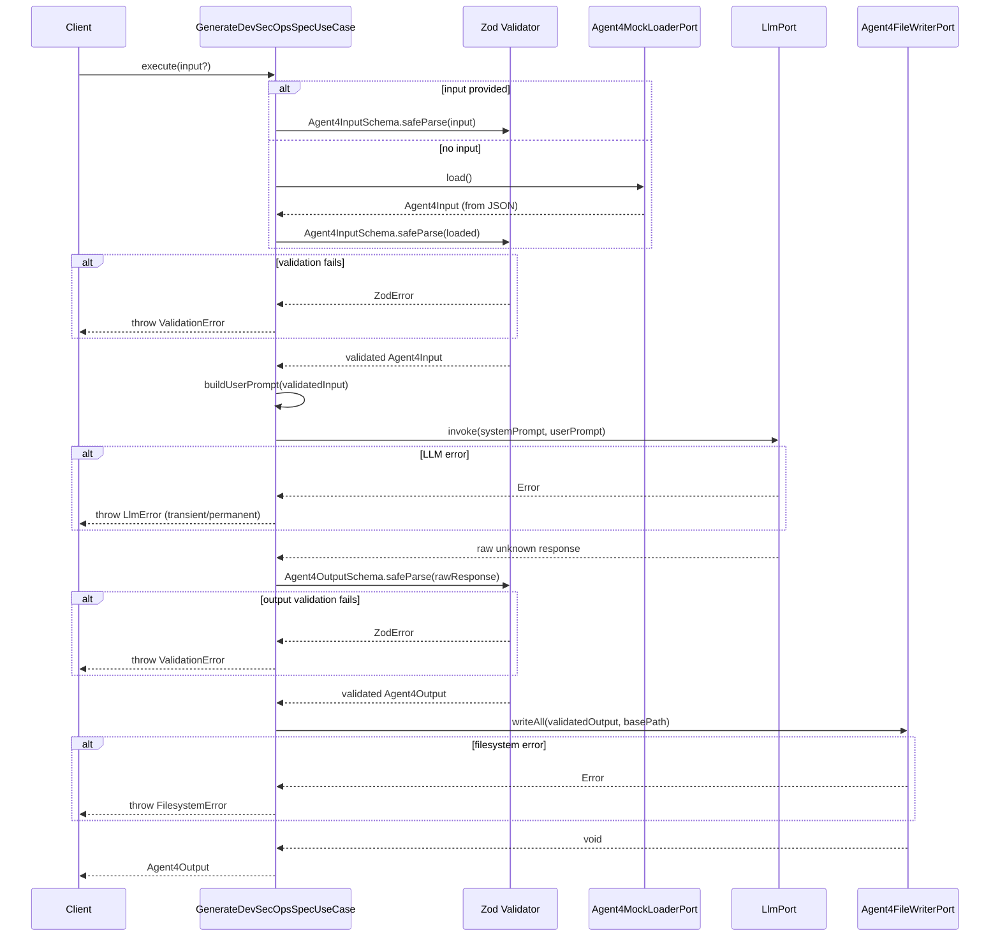

# Design Document: Agent 4 — DevSecOps, Quality & Automation Engineer

## Overview

Agent 4 is the final pipeline stage in KiroSpec Studio. It consumes validated outputs from Agents 1, 2, and 3 and generates production-ready DevSecOps artifacts: a multi-stage Dockerfile, a docker-compose.yml for local development, a GitHub Actions CI/CD workflow, and two security hook scripts (validate-specs and scan-secrets).

The design follows Clean Architecture with constructor-based dependency injection, mirroring the established Agent 2 patterns. All input/output boundaries are guarded by Zod schemas. An LLM generates the artifact content from a structured system prompt and serialized input context, with mock fallback for offline demonstration.

### Key Design Decisions

| Decision | Rationale |
|----------|-----------|
| Reuse `LlmPort` interface from Agent 2 | Same contract (system prompt + user prompt → unknown); avoids interface duplication |
| Separate `Agent4FileWriterPort` | Agent 4 writes to different paths with executable permissions; cannot reuse Agent 2's `FileWriterPort` directly |
| Dedicated `Agent4MockLoaderPort` | Loads `Agent4Input` (composite of Agents 1+2+3) vs Agent 2's `Agent1Output` |
| Builder functions as prompt construction | The LLM receives a single composite prompt; individual "builders" are conceptual prompt sections, not separate LLM calls |
| Zod refinements for structural content checks | `dockerfile.includes("FROM")` etc. catches malformed LLM output cheaply before file I/O |

---

## Architecture

### High-Level Class Diagram

```mermaid
classDiagram
    direction TB

    class GenerateDevSecOpsSpecUseCase {
        -llm: LlmPort
        -mockLoader: Agent4MockLoaderPort
        -fileWriter: Agent4FileWriterPort
        -systemPrompt: string
        +execute(input?: Agent4Input): Promise~Agent4Output~
    }

    class LlmPort {
        <<interface>>
        +invoke(systemPrompt: string, userPrompt: string): Promise~unknown~
    }

    class Agent4MockLoaderPort {
        <<interface>>
        +load(): Promise~Agent4Input~
    }

    class Agent4FileWriterPort {
        <<interface>>
        +writeAll(output: Agent4Output, basePath: string): Promise~void~
    }

    class VercelAiLlmClient {
        -model: string
        +invoke(systemPrompt, userPrompt): Promise~unknown~
    }

    class MockLlmClient {
        -fixedResponse: unknown
        +invoke(systemPrompt, userPrompt): Promise~unknown~
    }

    class Agent4JsonMockLoader {
        -mockPath: string
        +load(): Promise~Agent4Input~
    }

    class Agent4FileWriter {
        +writeAll(output: Agent4Output, basePath: string): Promise~void~
    }

    class Agent4InputSchema {
        <<zod>>
    }

    class Agent4OutputSchema {
        <<zod>>
    }

    GenerateDevSecOpsSpecUseCase --> LlmPort
    GenerateDevSecOpsSpecUseCase --> Agent4MockLoaderPort
    GenerateDevSecOpsSpecUseCase --> Agent4FileWriterPort

    VercelAiLlmClient ..|> LlmPort
    MockLlmClient ..|> LlmPort
    Agent4JsonMockLoader ..|> Agent4MockLoaderPort
    Agent4FileWriter ..|> Agent4FileWriterPort

    GenerateDevSecOpsSpecUseCase ..> Agent4InputSchema : validates input
    GenerateDevSecOpsSpecUseCase ..> Agent4OutputSchema : validates output
```



### Layer Mapping

| Layer | Responsibility | Agent 4 Artifacts |
|-------|---------------|-------------------|
| **Domain** | Pure types, schemas, error hierarchy | `types.ts` (Agent4Input, Agent4Output), `schemas.ts` (Agent4InputSchema, Agent4OutputSchema), `errors.ts` (shared) |
| **Application** | Orchestration use case, port interfaces | `generate-devsecops-spec.ts` |
| **Infrastructure** | Concrete adapters | `agent4-file-writer.ts`, `agent4-mock-loader.ts`, reuse `llm-client.ts` + `mock-llm-client.ts` |
| **Config** | System prompt constant | `agent4-system-prompt.ts` |
| **Presentation** | Factory + demo script | `src/index.ts` (createAgent4), `scripts/demo-agent4.ts` |

---

## Components and Interfaces

### Sequence Diagram — GenerateDevSecOpsSpec Pipeline



### Port Interfaces

```typescript
// Reused from Agent 2 — no change needed
export interface LlmPort {
  invoke(systemPrompt: string, userPrompt: string): Promise<unknown>;
}

// New: loads composite Agent4Input mock data
export interface Agent4MockLoaderPort {
  load(): Promise<Agent4Input>;
}

// New: writes Agent4 output files with executable permissions
export interface Agent4FileWriterPort {
  writeAll(output: Agent4Output, basePath: string): Promise<void>;
}
```

### Component Descriptions

#### 1. GenerateDevSecOpsSpecUseCase

The orchestrator. Accepts four constructor dependencies (LlmPort, Agent4MockLoaderPort, Agent4FileWriterPort, systemPrompt). Its `execute(input?)` method drives the full pipeline: validate input → build prompt → invoke LLM → validate output → write files → return output.

#### 2. Agent4FileWriter (Infrastructure)

Maps `Agent4Output` fields to target file paths:

| Field | Target Path | Permissions |
|-------|------------|-------------|
| `dockerfile` | `Dockerfile` | default (0o644) |
| `dockerCompose` | `docker-compose.yml` | default (0o644) |
| `ciPipeline` | `.github/workflows/ci.yml` | default (0o644) |
| `hooks.validateSpecs` | `.kiro/hooks/validate-specs.sh` | 0o755 |
| `hooks.scanSecrets` | `.kiro/hooks/scan-secrets.sh` | 0o755 |

Creates directories recursively. Overwrites existing files. Throws `FilesystemError` on failure.

#### 3. Agent4JsonMockLoader (Infrastructure)

Reads `.kiro/mocks/agent4.mock.json`, parses JSON, validates against `Agent4InputSchema`. Throws `FilesystemError` on read failure, `ValidationError` on parse/schema failure.

#### 4. Agent4 System Prompt (Config)

A multi-section prompt instructing the LLM to produce JSON matching `Agent4OutputSchema`. Sections correspond to:
- **Dockerfile Builder**: multi-stage, Alpine base, non-root user, healthcheck, minimal copy
- **Compose Builder**: app service + optional DB, named volumes, network segmentation
- **CI Pipeline Builder**: lint → typecheck → test → security → license-check → build → deploy
- **Hook Script Builder**: validate-specs.sh (EARS checks, Mermaid, deps) and scan-secrets.sh (patterns, allowlist)

#### 5. createAgent4() Factory (Presentation/Entry)

```typescript
export interface CreateAgent4Options {
  model?: string;                // default "gpt-4o"
  mockPath?: string;             // default ".kiro/mocks/agent4.mock.json"
  mockLlmResponse?: unknown;     // bypasses real LLM
}

export function createAgent4(options?: CreateAgent4Options): GenerateDevSecOpsSpecUseCase;
```

---

## Data Models

### Agent4Input

```typescript
export interface Agent4SecurityPolicy {
  name: string;        // 1–256 chars
  description: string; // 1–256 chars
  enforcement: string; // 1–256 chars
}

export interface Agent4TaskItem {
  id: string;           // 1–64 chars
  title: string;        // 1–256 chars
  description: string;  // 1–1024 chars
  dependencies: string[]; // each 1–64 chars, max 50
}

export interface Agent4LicenseEntry {
  package: string;
  license: string;
}

export interface Agent4ComplianceReport {
  licenseSummary: Agent4LicenseEntry[];  // min 1
  regulatoryFlags: string[];             // each non-empty
}

export interface Agent4Input {
  projectName: string;                    // 1–128 chars
  stack: string[];                        // each 1–64 chars, min 1, max 20
  architecturePattern: string;            // constrained values
  securityPolicies: Agent4SecurityPolicy[]; // min 1
  taskList: Agent4TaskItem[];             // min 1, max 200
  complianceReport: Agent4ComplianceReport;
}
```

### Agent4Output

```typescript
export interface Agent4Hooks {
  validateSpecs: string;  // min 10 chars, starts with "#!/"
  scanSecrets: string;    // min 10 chars, starts with "#!/"
}

export interface Agent4Output {
  dockerfile: string;     // min 20 chars, contains 2+ "FROM"
  dockerCompose: string;  // min 20 chars, contains "services"
  ciPipeline: string;     // min 20 chars, contains "jobs"
  hooks: Agent4Hooks;
}
```

### Zod Schema Definitions

```typescript
// Agent4InputSchema
export const Agent4SecurityPolicySchema = z.object({
  name: z.string().min(1).max(256),
  description: z.string().min(1).max(256),
  enforcement: z.string().min(1).max(256),
});

export const Agent4TaskItemSchema = z.object({
  id: z.string().min(1).max(64),
  title: z.string().min(1).max(256),
  description: z.string().min(1).max(1024),
  dependencies: z.array(z.string().min(1).max(64)).max(50),
});

export const Agent4LicenseEntrySchema = z.object({
  package: z.string().min(1),
  license: z.string().min(1),
});

export const Agent4ComplianceReportSchema = z.object({
  licenseSummary: z.array(Agent4LicenseEntrySchema).min(1),
  regulatoryFlags: z.array(z.string().min(1)),
});

export const Agent4InputSchema = z.object({
  projectName: z.string().min(1).max(128),
  stack: z.array(z.string().min(1).max(64)).min(1).max(20),
  architecturePattern: z.string().min(1),
  securityPolicies: z.array(Agent4SecurityPolicySchema).min(1),
  taskList: z.array(Agent4TaskItemSchema).min(1).max(200),
  complianceReport: Agent4ComplianceReportSchema,
});

// Agent4OutputSchema with structural refinements
export const Agent4HooksSchema = z.object({
  validateSpecs: z.string().min(10).refine(s => s.startsWith("#!/"), {
    message: "Hook must start with shebang"
  }),
  scanSecrets: z.string().min(10).refine(s => s.startsWith("#!/"), {
    message: "Hook must start with shebang"
  }),
});

export const Agent4OutputSchema = z.object({
  dockerfile: z.string().min(20).refine(
    s => (s.match(/FROM/g) || []).length >= 2,
    { message: "Dockerfile must contain at least two FROM directives (multi-stage)" }
  ),
  dockerCompose: z.string().min(20).refine(
    s => s.includes("services"),
    { message: "docker-compose must contain 'services' key" }
  ),
  ciPipeline: z.string().min(20).refine(
    s => s.includes("jobs"),
    { message: "CI pipeline must contain 'jobs' key" }
  ),
  hooks: Agent4HooksSchema,
});
```

### Module Structure

```
src/
├── domain/
│   ├── types.ts              ← add Agent4Input, Agent4Output, Agent4Hooks, etc.
│   ├── schemas.ts            ← add Agent4InputSchema, Agent4OutputSchema
│   └── errors.ts             ← shared (no changes needed)
├── application/
│   ├── generate-architecture-spec.ts   ← existing Agent 2
│   └── generate-devsecops-spec.ts      ← NEW: Agent 4 use case + port interfaces
├── infrastructure/
│   ├── llm-client.ts                   ← reused (VercelAiLlmClient)
│   ├── mock-llm-client.ts             ← reused (MockLlmClient)
│   ├── mock-loader.ts                 ← existing Agent 2 loader
│   ├── agent4-mock-loader.ts          ← NEW: loads agent4.mock.json
│   ├── kiro-file-writer.ts            ← existing Agent 2 writer
│   └── agent4-file-writer.ts          ← NEW: writes Agent 4 outputs with perms
├── config/
│   ├── system-prompt.ts               ← existing Agent 2 prompt
│   └── agent4-system-prompt.ts        ← NEW: Agent 4 LLM prompt
├── presentation/
│   └── api/...                         ← existing routes
├── index.ts                            ← add createAgent4 + exports
└── __tests__/
    ├── application/
    │   └── generate-devsecops-spec.property.ts  ← NEW
    ├── domain/
    │   └── agent4-schemas.property.ts           ← NEW
    └── infrastructure/
        └── agent4-file-writer.property.ts       ← NEW

scripts/
└── demo-agent4.ts                      ← NEW

.kiro/mocks/
└── agent4.mock.json                    ← NEW: valid Agent4Output for demo
```

---

## Correctness Properties

*A property is a characteristic or behavior that should hold true across all valid executions of a system — essentially, a formal statement about what the system should do. Properties serve as the bridge between human-readable specifications and machine-verifiable correctness guarantees.*

### Property 1: Valid Agent4Input round-trip through schema

*For any* valid `Agent4Input` object (with all fields meeting length, count, and type constraints), parsing it with `Agent4InputSchema.safeParse()` SHALL succeed and the parsed data SHALL be deeply equal to the original object.

**Validates: Requirements 1.1, 1.2, 1.3**

### Property 2: Valid Agent4Output round-trip through schema

*For any* valid `Agent4Output` object (where dockerfile contains 2+ "FROM", dockerCompose contains "services", ciPipeline contains "jobs", and hooks start with "#!/"), parsing it with `Agent4OutputSchema.safeParse()` SHALL succeed and the parsed data SHALL be deeply equal to the original object.

**Validates: Requirements 2.1, 2.2, 2.3, 2.4, 2.5**

### Property 3: Whitespace-only strings are rejected

*For any* string composed entirely of whitespace characters (spaces, tabs, newlines), when injected into any string field of an `Agent4Input` object, `Agent4InputSchema.safeParse()` SHALL return `success: false` with an error path referencing the affected field.

**Validates: Requirements 1.5**

### Property 4: Schema validation failures produce correct ValidationError

*For any* invalid input or output object that fails Zod schema parsing, the use case's error mapping SHALL produce a `ValidationError` whose `fieldPath` matches the Zod error's first issue path, and whose `operation` correctly identifies the validation stage ("input-validation" or "output-validation").

**Validates: Requirements 1.4, 2.6, 12.1**

### Property 5: Input validation precedes LLM invocation

*For any* invalid `Agent4Input` object (violating any schema constraint), calling `execute()` with that input SHALL throw a `ValidationError` and the LLM port's `invoke` method SHALL never be called.

**Validates: Requirements 3.1, 3.3**

### Property 6: LLM error classification by transient keywords

*For any* error message string, if it contains "timeout", "ECONNRESET", or "503" then the resulting `LlmError` SHALL have `isTransient === true`; for all other error messages, `isTransient` SHALL be `false`.

**Validates: Requirements 3.4, 12.2, 12.3, 12.4**

### Property 7: File writer maps all output fields to correct paths

*For any* valid `Agent4Output` object and any base path, calling `writeAll()` SHALL write exactly 5 files: `Dockerfile`, `docker-compose.yml`, `.github/workflows/ci.yml`, `.kiro/hooks/validate-specs.sh`, `.kiro/hooks/scan-secrets.sh` — each containing the corresponding field's content verbatim.

**Validates: Requirements 9.1, 9.2, 9.3, 9.4, 9.5**

### Property 8: Filesystem errors wrapped with path and cause

*For any* file path that triggers a write failure, the `Agent4FileWriter` SHALL throw a `FilesystemError` whose `targetPath` matches the attempted file path and whose `cause` property preserves the original OS error.

**Validates: Requirements 9.7, 12.5**

---

## Error Handling

Agent 4 reuses the existing typed error hierarchy from the domain layer. All errors bubble up as typed instances:

| Error Type | Trigger | Key Fields |
|-----------|---------|------------|
| `ValidationError` | Zod parse failure on input or LLM output | `fieldPath`, `expectedType`, `receivedValue`, `operation` |
| `LlmError` | LLM invocation failure | `isTransient`, `operation`, `context`, `cause` |
| `FilesystemError` | File write failure | `targetPath`, `operation`, `cause` |

### Error Flow

1. **Input validation fails** → `ValidationError` with `operation: "input-validation"`
2. **LLM invocation throws** → `LlmError` with transient/permanent classification based on error message keywords
3. **Output validation fails** → `ValidationError` with `operation: "output-validation"`
4. **File write fails** → `FilesystemError` with absolute target path

### Transient Error Detection

```typescript
const TRANSIENT_PATTERNS = ["timeout", "ECONNRESET", "503"];

function isTransientError(error: Error): boolean {
  return TRANSIENT_PATTERNS.some(pattern => error.message.includes(pattern));
}
```

Consumers can retry on `LlmError` where `isTransient === true`.

---

## Testing Strategy

### Dual Testing Approach

| Test Type | Scope | Tool |
|-----------|-------|------|
| **Property-based tests** | Schema round-trips, validation correctness, error classification, file mapping | Vitest + fast-check, 100+ iterations |
| **Unit tests (example-based)** | Factory wiring, mock loader behavior, demo script, specific edge cases | Vitest |
| **Integration tests** | End-to-end pipeline with mocked LLM, demo script execution | Vitest |

### Property-Based Testing Configuration

- **Library**: `fast-check` (already used in project)
- **Runner**: Vitest (configured to include `*.property.ts` files)
- **Minimum iterations**: 100 per property
- **Tag format**: `Feature: agent4-devsecops, Property {N}: {title}`

### Test File Layout

| File | Properties / Tests |
|------|-------------------|
| `src/__tests__/domain/agent4-schemas.property.ts` | Properties 1, 2, 3 |
| `src/__tests__/application/generate-devsecops-spec.property.ts` | Properties 4, 5, 6 |
| `src/__tests__/infrastructure/agent4-file-writer.property.ts` | Properties 7, 8 |
| `src/__tests__/application/generate-devsecops-spec.test.ts` | Unit tests for factory, mock loader fallback, demo behavior |
| `src/__tests__/integration/agent4-pipeline.test.ts` | Full pipeline with mocked LLM verifying Dockerfile/Compose/CI content |

### Unit Test Coverage (Example-Based)

- Factory `createAgent4()` with various option combinations
- Mock loader reads from correct default/custom path
- Demo script prints expected output format
- Hook permission bits set to 0o755
- Directory creation for nested paths

### What Is NOT Property-Tested

Content requirements for LLM-generated artifacts (Dockerfile structure, Compose networking, CI job ordering, hook script logic) are verified via integration tests with a mocked LLM returning known-good output. These are INTEGRATION-level concerns because:
- The behavior doesn't vary meaningfully with input (the LLM generates based on instructions)
- Testing 100 iterations won't find more bugs than 2-3 iterations
- We're verifying LLM output quality, not our code's logic

