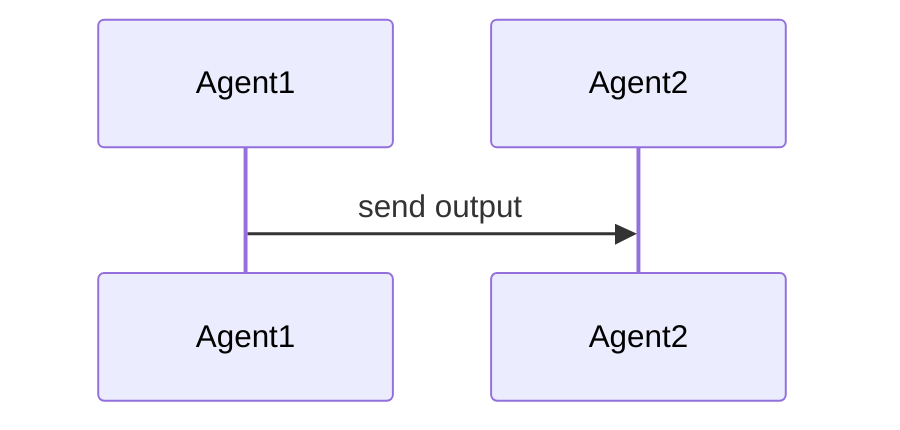

## Domain Entities

### Project

Properties:
- id: string (required)
- name: string (required)

Relationships: has many Features

## Sequence Diagram

## IAM Policies

| Service | Actions | Resource | Effect |
| --- | --- | --- | --- |
| Lambda | lambda:InvokeFunction | arn:aws:lambda:*:*:function:test | Allow |

## AWS Cost Projection

### MVP

| Service | Monthly Cost (USD) |
| --- | --- |
| Lambda | $5.00 |

### Scale

| Service | Monthly Cost (USD) |
| --- | --- |
| Lambda | $50.00 |
